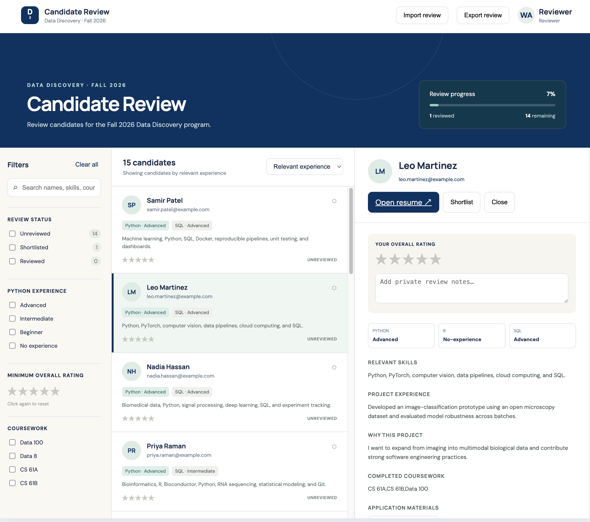

# Candidate Review

A local review workspace for the applications in `applications.csv`.

> **Demo data notice:** All candidates, names, contact information, application responses, portfolios, and resumes included in the public demo dataset are synthetic. They do not represent real people or actual applications.

## Preview



## Run it

From this folder:

```bash
python3 -m http.server 8000
```

Then open [http://localhost:8000](http://localhost:8000).

Ratings, notes, and shortlist decisions stay in the browser's local storage. If your browser clears site data when it closes, use **Export review** before closing it. The next time you open the interface, choose **Import review** and select that CSV to restore your ratings, notes, and statuses.
